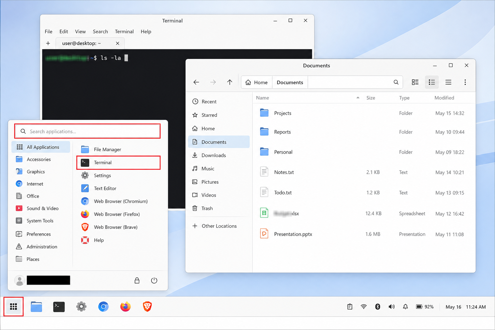

**Effective IT Work Instructions**

Business guide for creating clear and consistent IT work instructions for efficient technical operations.

In business and enterprise IT, clear, effective, and useful work instructions help the IT department and its technicians perform tasks consistently, accurately, and with less friction and unnecessary guesswork. That means less wasted time for the organization and a better ability to solve problems more quickly. A quality work instruction is designed to explain what needs to be done, where the technician needs to go, what actions need to be taken, what results can be expected, any possible deviations or variations, and when the technician should complete the task or escalate it. The goal is not to document every mouse movement and click. The goal is to provide enough information for the technician to complete the work correctly without creating unnecessary confusion or repetition.

Effective work instructions provide clear business value. They can reduce training time, improve consistency among technicians, support smoother handoffs, reduce dependency on tribal knowledge, and help incidents get resolved more efficiently and quickly. This project documents the principles businesses can use when creating clear, accurate, and up-to-date technical work instructions. These work instructions use appropriate detail, screenshots, exact paths and commands, expected results, validation practices, escalation points, and links to related procedures and work instructions. Highly effective technical documentation supports technicians and their performance, supports business uptime and productivity, and ultimately supports the efficiency and profitability of the business.

**Objectives**
- Define the core principles of a clear, accurate, and effective IT work instruction.
- Show how work instructions can improve efficiency, consistency, training, handoffs, and technician performance.
- Explain how to balance enough detail for accuracy without creating unnecessary repetition or clutter.
- Demonstrate how screenshots, exact paths, commands, expected results, validation steps, and escalation points can improve technical documentation.
- Show how related work instructions can be linked together to reduce duplication and create a more organized and maintainable documentation system.

**Core Principles**

Define Purpose and Scope: State what the instruction accomplishes, when to use it, and what systems it applies to.

Provide Exact Actions: Identify the the exact system, menu, command, file path, server, or administrative tool.

Use the Right Amount of Detail: Give enough information to complete the task without unnecessary repetition.

Use Screenshots With Purpose: Highlight the exact button, field, command, status, or result the technician needs to recognize.

Explain Expected Results: Tell the technician what success should look like.

Include Validation: Require a test that confirms the intended result.

Define Escalation Points: Explain when to stop, what evidence to collect, and when another team should be engaged.

Link Related Work Instructions: Reference existing procedures instead of repeating the same process.

Build Modular Documentation: Connect related work instructions without creating dependence on tribal knowledge.

Keep Instructions Current: Review and update procedures, screenshots, commands, paths, and validation steps as the environment changes.

**Example Screenshot**

- Use screenshots to show the technician exactly where to click, enter information, or confirm a result.
- Highlight only the areas that matter so the technician is not distracted by unnecessary information.
- Redact usernames, internal tools, sensitive file names, or other information that does not need to appear in the work instruction.

**Example Work Instruction Structure**

- Purpose and Scope: Explain what the instruction accomplishes and when it should be used.
- Prerequisites: Identify required access, credentials, tools, systems, or related procedures.
- Procedure: Provide clear actions in the correct order.
- Expected Results: Explain what the technician should see after important steps.
- Validation: Confirm that the intended result was actually achieved.
- Escalation: Define when to stop, what evidence to collect, and which team should receive the issue.
- Related Work Instructions: Link supporting procedures rather than repeating them.
- Ownership and Review: Identify who maintains the document and when it was last reviewed.

**Lessons Learned**
- Heavy reliance on tribal knowledge can slow down new technicians and make it harder for them to get up to speed efficiently.
- Clear and standardized work instructions reduce wasted time by helping technicians know what to do, where to go, and how to validate the result.
- Consistent documentation supports smoother handoffs, better teamwork, and stronger technician confidence and morale.
- Accurate and current work instructions support integrity and honesty by making sure technicians are working from information the business can actually rely on.
- Better documentation supports uptime, efficiency, customer satisfaction, and profitability by reducing unnecessary delays, confusion, and repeated troubleshooting.

**Summary**

Effective work instructions help turn technical knowledge into a repeatable process that the whole IT department can use. They reduce dependency on tribal knowledge, improve standardization, and help technicians get up to speed more quickly without wasting time trying to figure out unclear or outdated procedures independently.

For the business, that means smoother operations, better handoffs, more consistent technical performance, and less unnecessary downtime. Clear, accurate, and useful documentation supports the technicians, supports the customers they serve, and helps the business operate more efficiently and profitably.

**Navigation**

[`Back to GitHub Profile`](https://www.github.com/cbueker-it)
